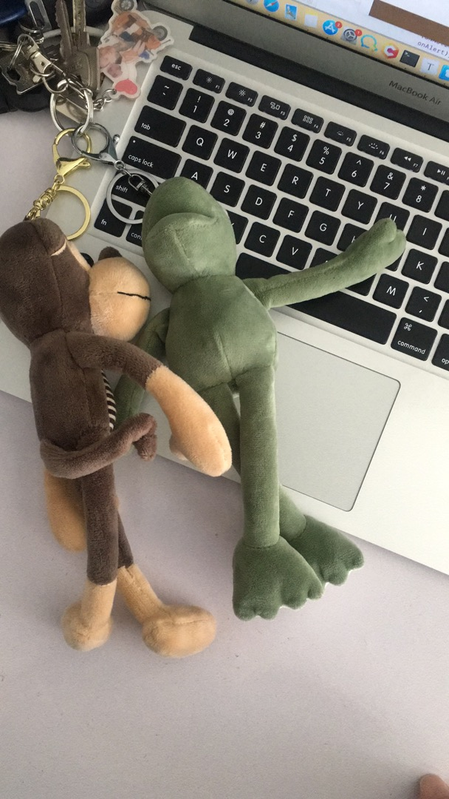

# 陈魏 二 字   

#### 也许无法填满整个卡片 
#### 甚至占据不了三行空间 
#### 却竞相开放在我心田 
#### 对影闻声与可怜，
#### 玉池荷叶正田田。

###### from your Valentines 20191020

# 和你在一起是毕生所求

 ####    追求你一辈子 

- 用追求阶段的方式和你过一辈子。（ 20191103梦见了 你教我弹钢琴。）
- 爱一旦说出口就变成了一种誓言，一种承诺。 你若不嫌弃 我便不离。
- 要你快乐 ，不让你累着。
- 你就得最好的 说过一辈子 就是一辈子
- 是你让我觉得生活奋斗的目标 、意义在哪里 

# 闯入你的生活 是三生有幸 ；

#### 你逛街总是能想到给买东西给我、考虑我的感受

* 两个钥匙串、布置一个美丽的家

* 侄女礼物

* 娃娃

* 办公坐垫

  

#### 谢谢你的一次又一次理解和包容：

- 我什么都不懂、只会犯下伤害你的事情 ，求原谅 。
- 明知这样会使你烦 、打扰你， 却每次都是发这么多你看不懂的文字 。总是出尔法尔 就是这种行为和情商不仅在什么宫斗戏活不了一集，而是所有的场景都活不长久 。因为违背了她人的信任 是最不可容忍的。

#### 有这么多缺点 而你却说太好了 

  刚认识你的时候，我是一个说话自相矛盾、不成熟、 太死板的我 每次都是按时睡觉吃饭写代码 。不知道什么是生活爱情！

- 喜欢贫嘴 让你生气 。

- 在你选择原谅我的时候，给我机会来安慰和哄你 ，但是我一直没有意思到这一点，不仅没有关心注意你的情绪，甚至还一直关注的是自己 。

- 一个不反思 、不改正的、太自私人。是奇葩 是一个大男子主义 不会照顾对方感受的。

- 犯错给自己找理由：强词夺理、偷换概念。

- 不知道什么是口红和唇釉

- 做事从不主动 不仅总要你提示 甚至提示了都做不好 （比如公司的靠垫没拿回家 其实从大儿子搬进来的第一天 看见你垫着空调被 就该把公司的垫拿回来了）我就是一个白眼狼。

- 不浪漫：无法让人得到信任感 、是个情书有毛病的人。

- 是一个不懂爱 却天天把爱挂在嘴边的人。

- 是个身在福中不知福的人

- 不仅不爱干净还表现一副洁癖的样子 、是个垃圾、 败类。

- 智障、不懂的珍惜、眼里只有自己 、总是说话伤人 这段时间你过的很辛苦 迁就了这么久 

- 答应陪你电视剧 又自己先睡 

- 爱你 但是又做不到真正意义上的让你快乐 反而让你受尽委屈 降低生活质量 委屈自己 。 

  

   

  

  

  

  

# 答应你的代班事项（todo）

- 纹身

- 蹦极

- 买衣服（第二件黑色的）、买小兔兔

  